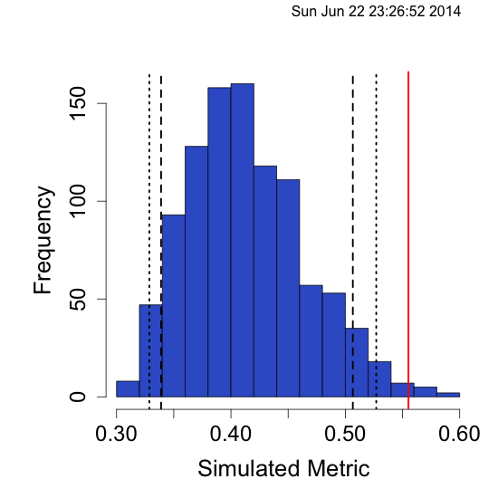
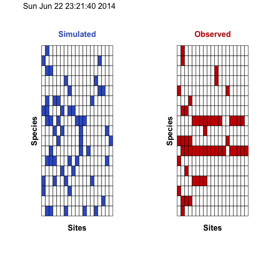

EcoSimR
=======

Test repository for EcoSimR, by Gotelli, N.J. and A.M. Ellison. 2013. EcoSimR 1.00.  http://www.uvm.edu/~ngotelli/EcoSim/EcoSim.html

QuickStart
=======

First install the dev branch
```r
library(devtools)
## use dev_mode() if you want to just play with this in a sandbox
install_github("EcoSimR","gotellilab",ref="dev")
```
Currently null models can be run on niche data and co-occurrence data
 
 
**Niche null models**
```r
library(EcoSimR)

warbMod <- niche_null_model(macwarb)
summary(warbMod)
plot(warbMod)
```



```r
finchMod <- cooc_null_model(wiFinches, algo="sim3")
summary(finchMod)
plot(finchMod)
```


