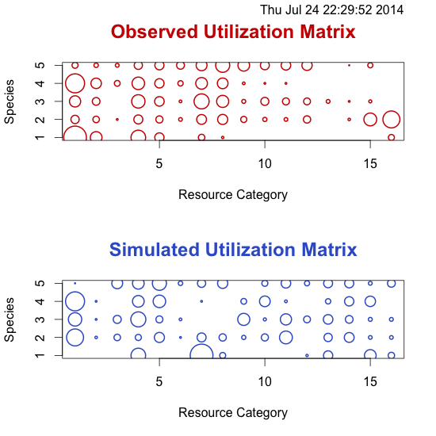
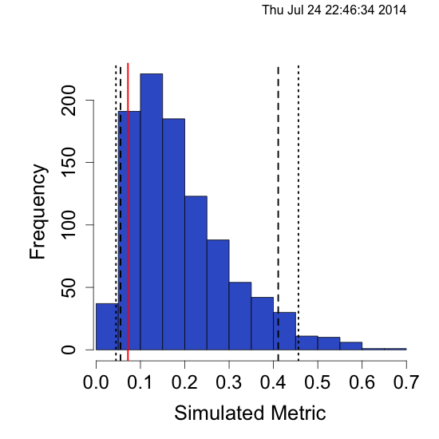

[](https://travis-ci.org/GotelliLab/EcoSimR)
[](https://ci.appveyor.com/project/emhart/ecosimr)
[](https://coveralls.io/r/GotelliLab/EcoSimR?branch=master)

EcoSimR
=======

Repository for EcoSimR, by Gotelli, N.J. and A.M. Ellison. 2013. EcoSimR 0.1.0  http://www.uvm.edu/~ngotelli/EcoSim/EcoSim.html

QuickStart
=======

First install the dev branch
```r
library(devtools)
install_github("gotellilab/EcoSimR")
```
Currently null models can be run on niche data, co-occurrence data, and size ratio data
 
**Niche null models**
```r
library(EcoSimR)

warbMod <- niche_null_model(macwarb)
summary(warbMod)
plot(warbMod,type="niche")
plot(warbMod, type="hist")
```
```r
Time Stamp:  Thu Jul 24 22:29:52 2014 
Random Number Seed:  -418884223 
Number of Replications:  1000 
Elapsed Time:  0.46 secs 
Metric:  pianka 
Algorithm:  ra3 
Observed Index:  0.55514 
Mean Of Simulated Index:  0.39145 
Variance Of Simulated Index:  0.0022785 
Lower 95% (1-tail):  0.32365 
Upper 95% (1-tail):  0.47571 
Lower 95% (2-tail):  0.31274 
Upper 95% (2-tail):  0.50608 
P(Obs <= null) =  0.997 
P(Obs >= null) =  0.003 
P(Obs = null) =  0 
Standardized Effect Size (SES):  3.4293 

```

*Niche plots*



*Histogram*


**Co-Occurrence Null Models**

```r
finchMod <- cooc_null_model(wiFinches, algo="sim3")
summary(finchMod)
plot(finchMod, typ="cooc")
plot(finchMod, type="hist")
```

```r
Time Stamp:  Thu Jul 24 22:42:17 2014 
Random Number Seed:  1969414287 
Number of Replications:  1000 
Elapsed Time:  2.7 secs 
Metric:  c_score 
Algorithm:  sim3 
Observed Index:  3.7941 
Mean Of Simulated Index:  7.2588 
Variance Of Simulated Index:  0.25058 
Lower 95% (1-tail):  6.6324 
Upper 95% (1-tail):  8.1905 
Lower 95% (2-tail):  6.5294 
Upper 95% (2-tail):  8.3912 
P(Obs <= null) =  0 
P(Obs >= null) =  1 
P(Obs = null) =  0 
Standardized Effect Size (SES):  -6.9214 

```

*Sample of shuffled matrix*


*Histogram*


Also when we run with the `simFast` algorithm we can get a burn in plot

```r
finchMod <- cooc_null_model(wiFinches, algo="simFast",burnin=500)
plot(finchMod,type="burnin")
```


**Size Ratio null models**

Lastly we can run null models on size ratios, and produce two different kinds of plots

```r
rodentMod <- size_null_model(rodents)
summary(rodentMod)
plot(rodentMode,type="size")
plot(rodentMode,type="hist")
```
```
Time Stamp:  Thu Jul 24 22:45:34 2014 
Random Number Seed:  -438432393 
Number of Replications:  1000 
Elapsed Time:  0.15 secs 
Metric:  var_ratio 
Algorithm:  uniform_size 
Observed Index:  0.071826 
Mean Of Simulated Index:  0.18809 
Variance Of Simulated Index:  0.012434 
Lower 95% (1-tail):  0.055043 
Upper 95% (1-tail):  0.41076 
Lower 95% (2-tail):  0.044767 
Upper 95% (2-tail):  0.45634 
P(Obs <= null) =  0.097 
P(Obs >= null) =  0.903 
P(Obs = null) =  0 
Standardized Effect Size (SES):  -1.0427 
```

*Size null model*


*Histogram*


